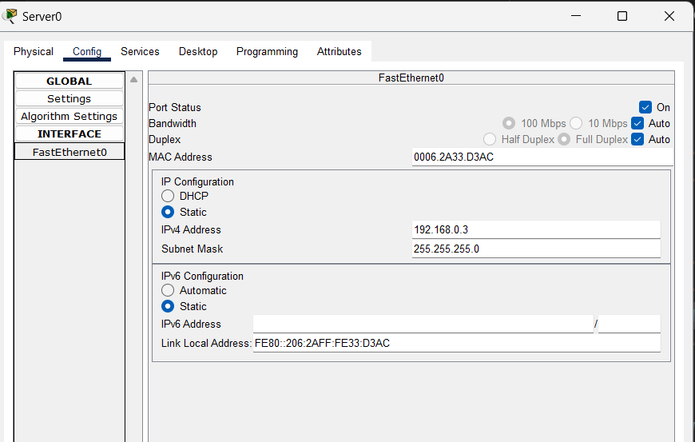
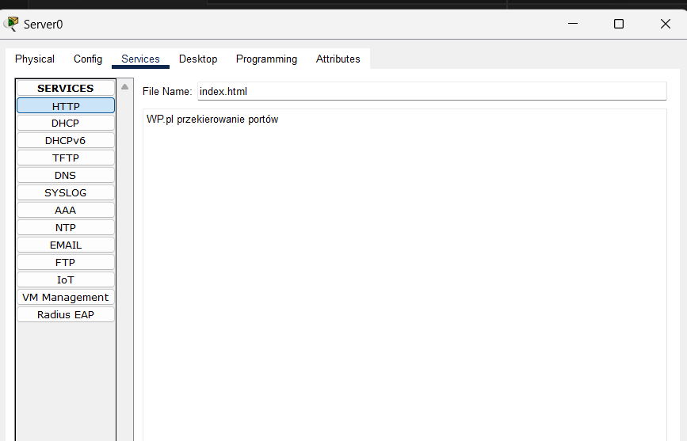
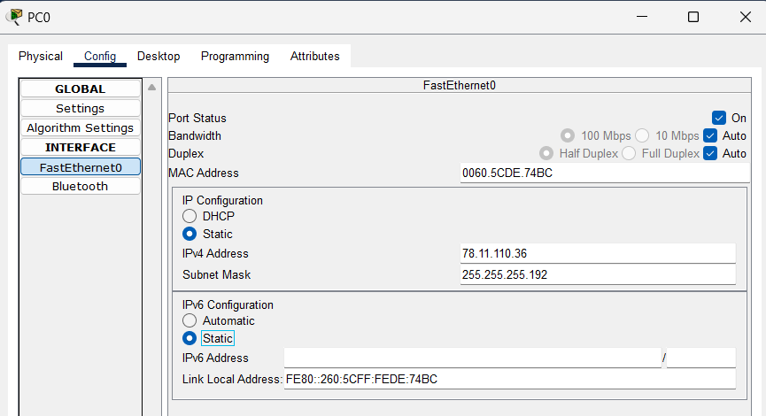
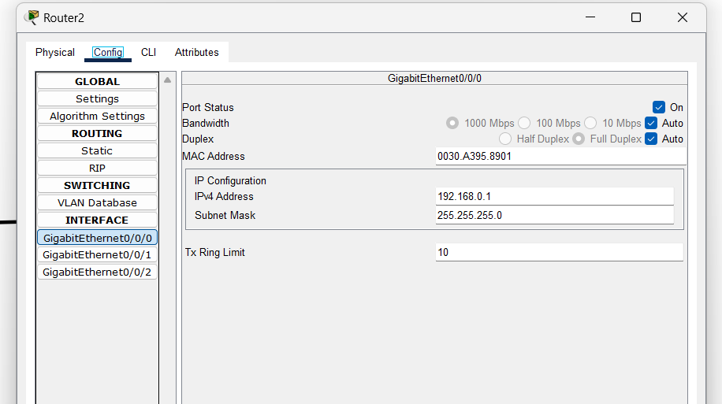

# schemat


# switch



## komendy do VLANów

```
configure terminal
vlan 10
name 10

vlan 20
name 20

interface FastEthernet0/1
switchport mode access
switchport access vlan 10 
interface FastEthernet0/2
switchport mode access
switchport access vlan 20 

interface GigabitEthernet0/1
switchport mode trunk
```

## pc 1


## pc 2


## pc 3


## pc 4


# pingi
## bez vlanów 


## z vlanmia

