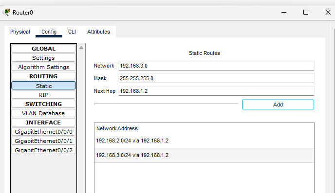
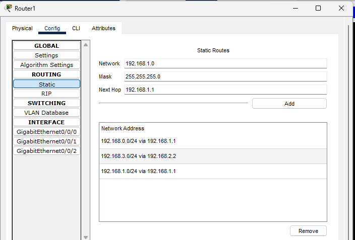

## temat: Routing IP router

### SCHEMAT

### R1

Router(config)#interface GigabitEthernet0/0/0
Router(config-if)#ip address 192.168.0.1 255.255.255.0
Router(config)#interface GigabitEthernet0/0/1
Router(config-if)#ip address 192.168.1.1 255.255.255.0
Router(config)#ip route 192.168.2.0 255.255.255.0 192.168.1.2
Router(config)#ip route 192.168.3.0 255.255.255.0 192.168.1.2
Router(config)#ip route 192.168.1.0 255.255.255.0 192.168.1.1

### R2

Router(config)#interface GigabitEthernet0/0/1
Router(config-if)#ip address 192.168.1.2 255.255.255.0
Router(config)#interface GigabitEthernet0/0/0
Router(config-if)#ip address 192.168.2.1 255.255.255.0
Router(config)#ip route 192.168.0.0 255.255.255.0 192.168.1.1
Router(config)#ip route 192.168.3.0 255.255.255.0 192.168.2.2

### R3

Router(config)#interface GigabitEthernet0/0/0
Router(config-if)#ip address 192.168.2.2 255.255.255.0
Router(config)#interface GigabitEthernet0/0/1
Router(config-if)#ip address 192.168.3.1 255.255.255.0
Router(config)#ip route 192.168.0.0 255.255.255.0 192.168.2.1
Router(config)#ip route 192.168.1.0 255.255.255.0 192.168.2.1

### SERWER

### STACJA ROBOCZA

## testy ping 

