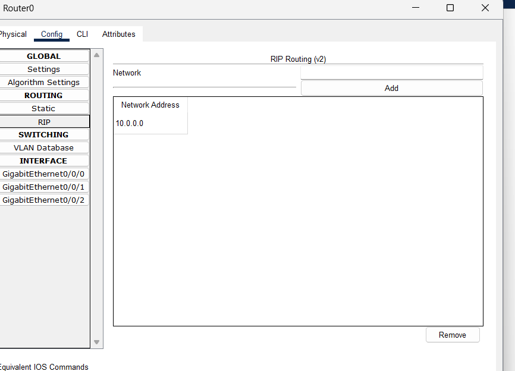
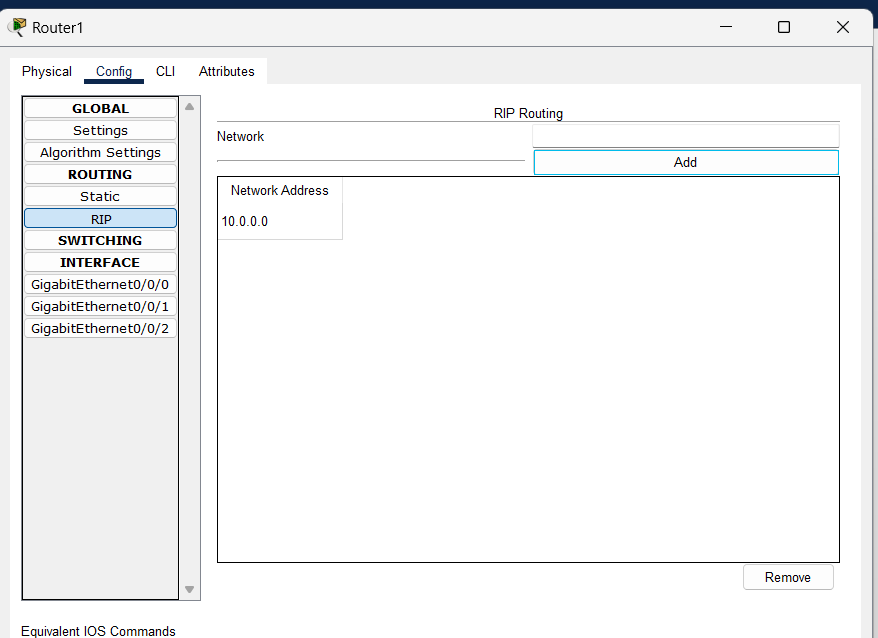
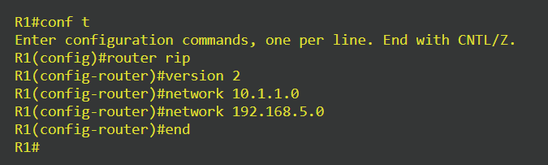
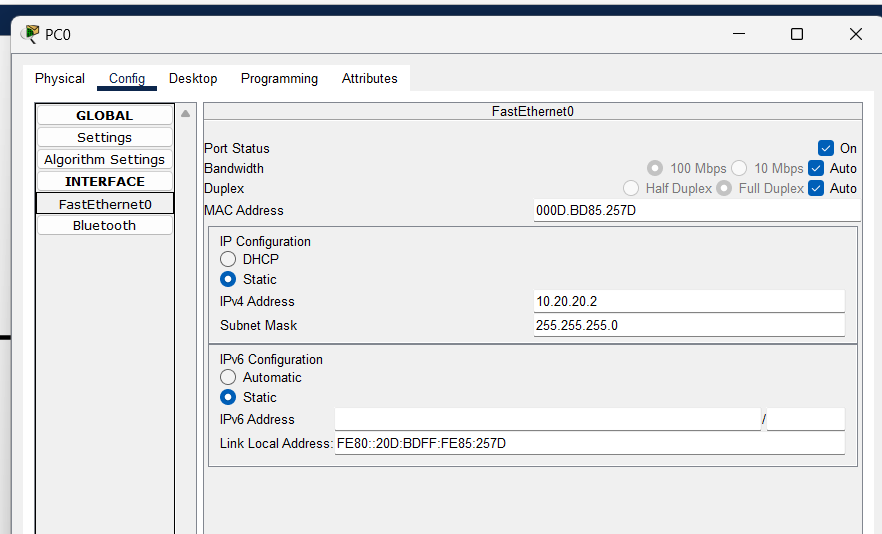
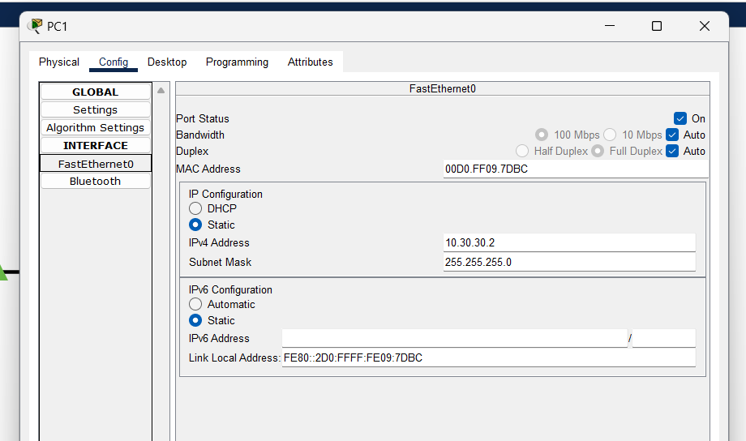
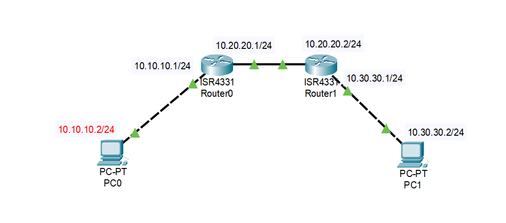
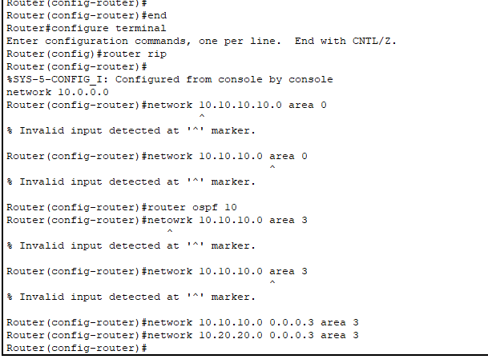

Lekcja 8
data: 12.10.2023r. 

Routing RIP:

Routing OSPF:

https://ipcisco.com/rip-configuration-with-packet-tracer/

https://www.sysnettechsolutions.com/en/configure-ospf-in-cisco-packet-tracer/

