# lekcja 9-3routery-ospf

## SCHEMAT
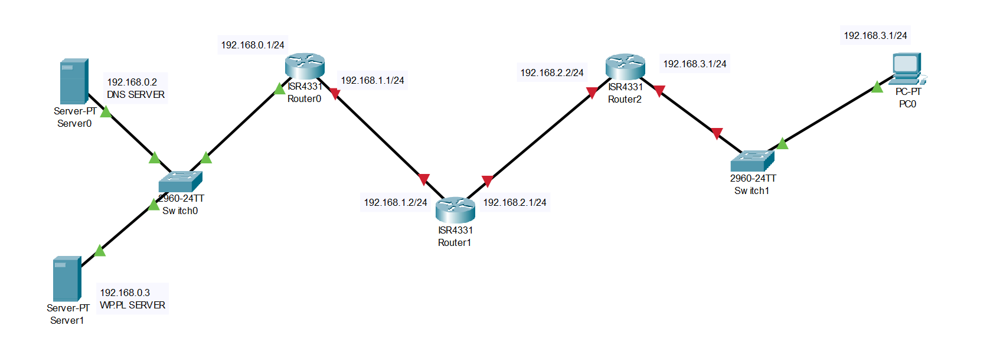

## R1
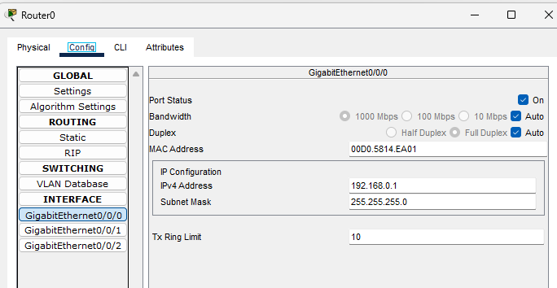
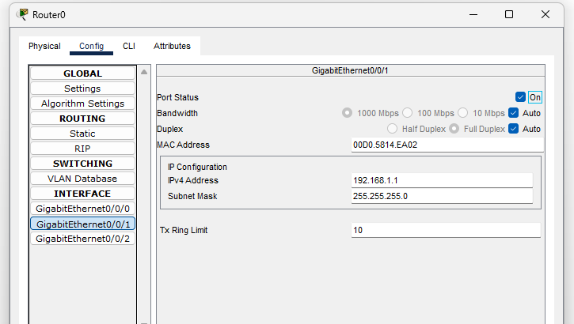

Router> enable
Router# configure terminal
Router(config)# router ospf 1
network 192.168.0.0 0.0.0.255 area 0
network 192.168.1.0 0.0.0.255 area 0
network 192.168.2.0 0.0.0.255 area 0
network 192.168.3.0 0.0.0.255 area 0
exit

## R2
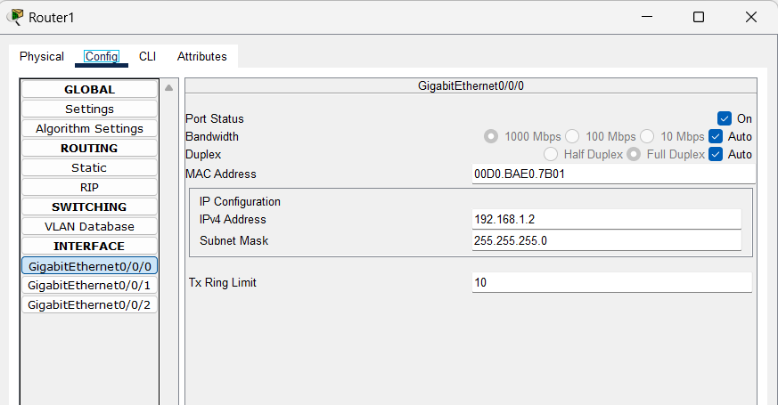
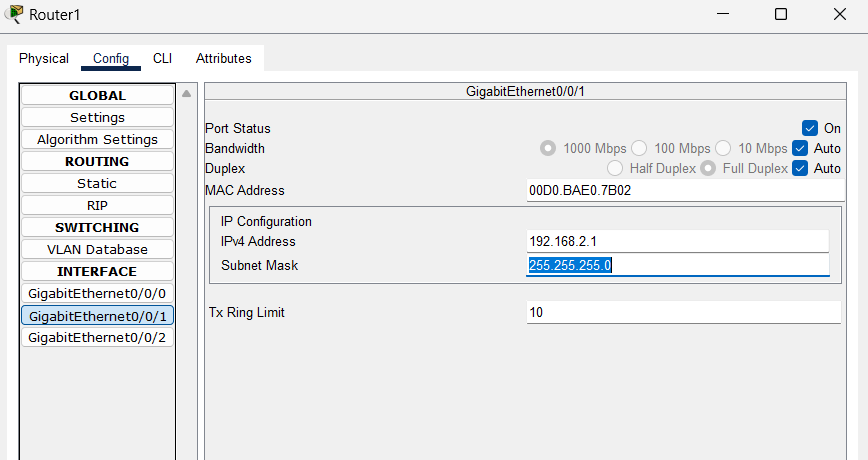

enable
configure terminal
router ospf 1
network 192.168.0.0 0.0.0.255 area 0
network 192.168.1.0 0.0.0.255 area 0
network 192.168.2.0 0.0.0.255 area 0
network 192.168.3.0 0.0.0.255 area 0
exit

## R3
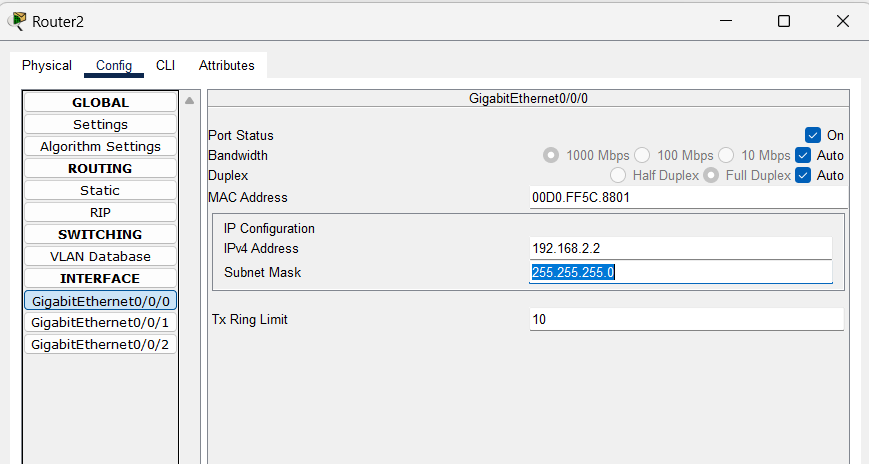
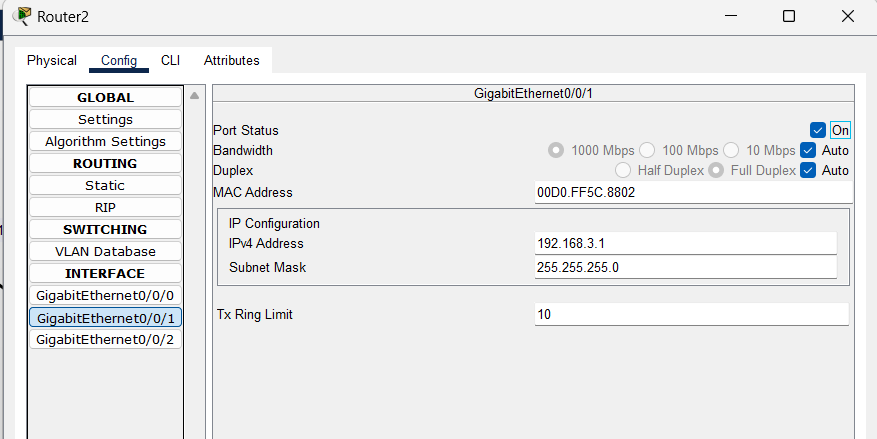
enable
configure terminal
router ospf 1
network 192.168.0.0 0.0.0.255 area 0
network 192.168.1.0 0.0.0.255 area 0
network 192.168.2.0 0.0.0.255 area 0
network 192.168.3.0 0.0.0.255 area 0
exit

## SERVER DNS
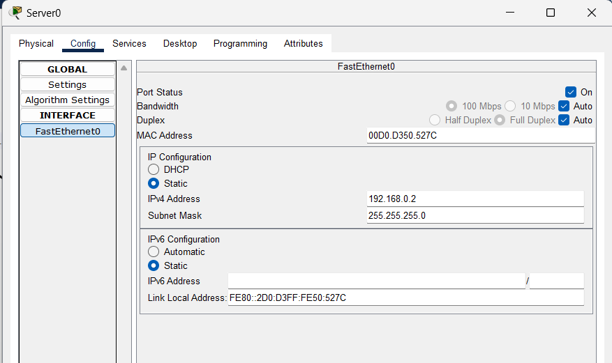
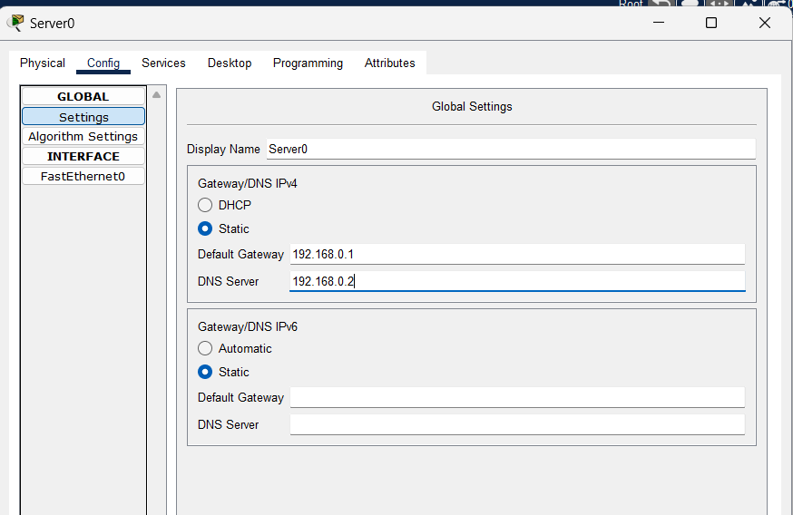
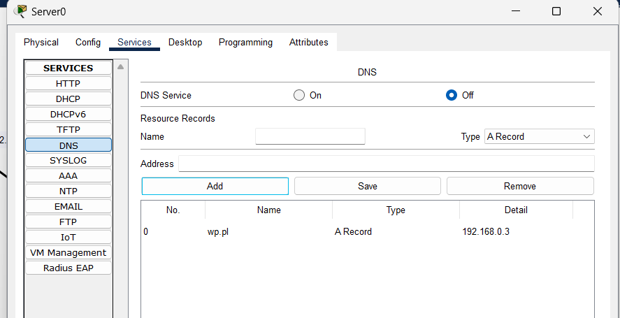

## SERVER HTTP

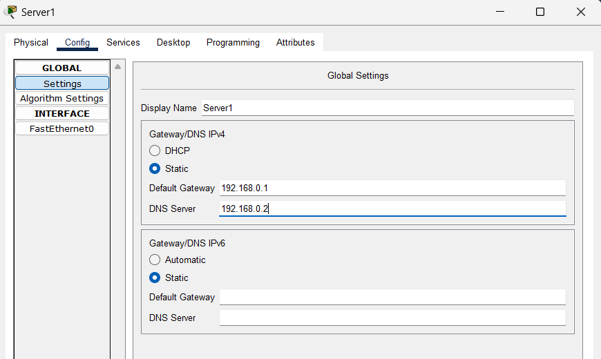

## STACJA ROBOCZA
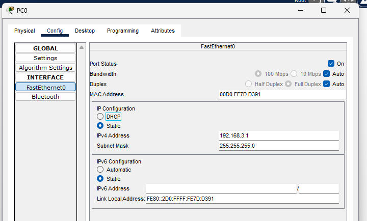
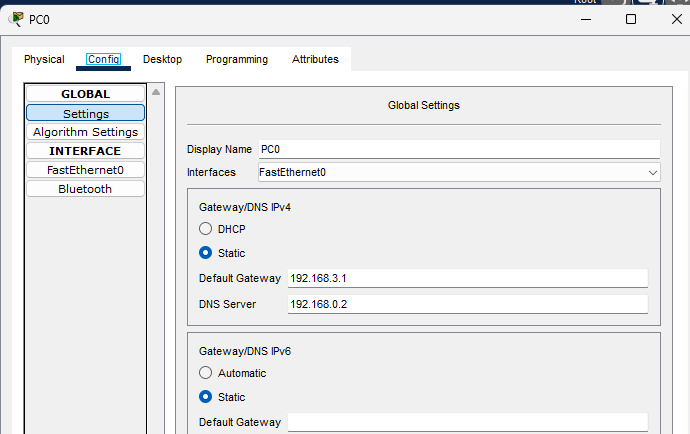

## PINGI 
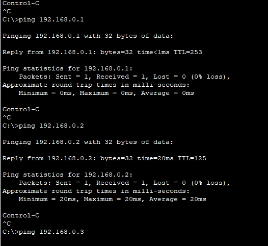
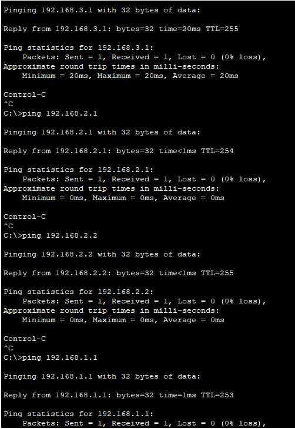

## FINAL WP.PL
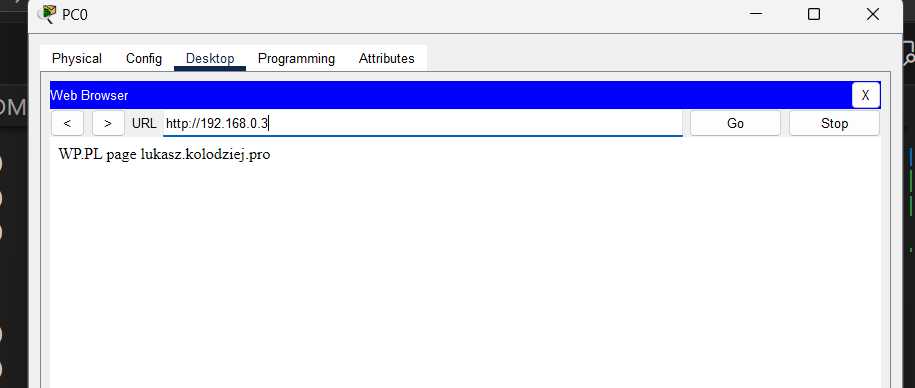
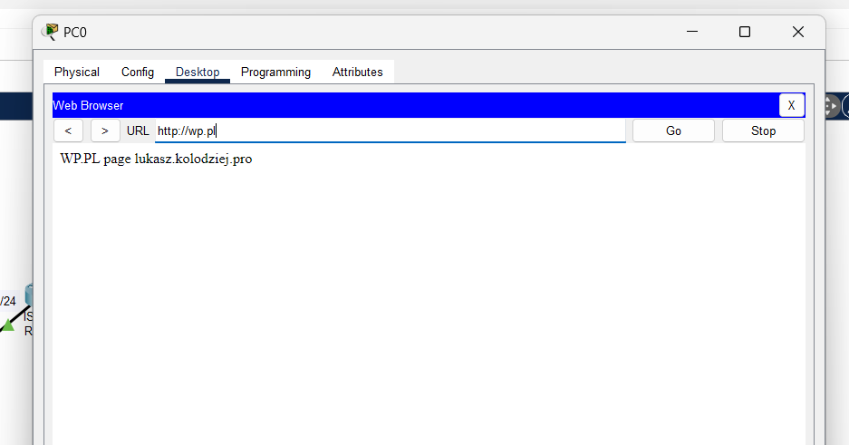
